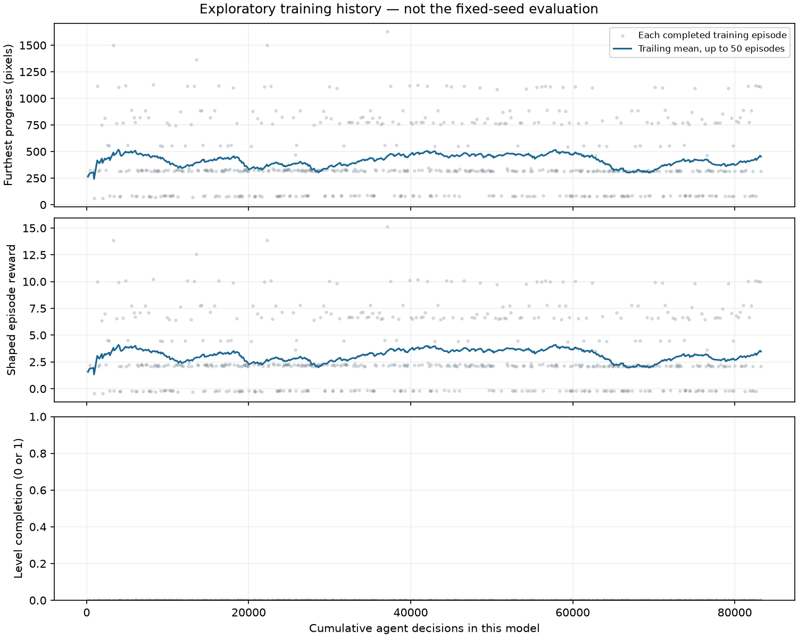

# Recovery-control pilot — learning analysis

The pilot completed in **10.28 wall minutes**, including **9.47 active training minutes**. This is a fresh seven-action PPO model, not a continuation of the five-action model. The reward and PPO settings were held fixed. [Experiment plan](PLAN.md) · [Measurements](REPORT.md).

## Untrained policy

Five trials produced 0/5 clears, all deaths, with mean progress 346.8 pixels and median 287. Seed 101 moves and jumps in the opening area, then dies near the first walking enemy. [Clip](00-untrained/trial-101-ending.gif) · [Trace](00-untrained/trial-101.jsonl). The best random sample travels 801 pixels; this does not demonstrate a learned strategy.

## Trained checkpoint — 9.47 active minutes

The run collected 332,420 action frames and 83,348 decisions, with 162 PPO train calls / 4,964 optimizer steps. Mean evaluation progress increased by 267.4 pixels, from 346.8 to 614.2. Median increased only from 287 to 315. All five trials still died, with 0/5 clears.

| Seed | Untrained progress | Trained progress | Change |
|---|---:|---:|---:|
| 101 | 49 | 82 | +33 |
| 202 | 287 | 84 | -203 |
| 303 | 801 | 1090 | +289 |
| 404 | 270 | 315 | +45 |
| 505 | 327 | 1500 | +1173 |

**Observed improvements:** [seed 505](01-stage/trial-505-ending.gif) reaches the gap before the wooden steps, while [seed 303](01-stage/trial-303-ending.gif) reaches an earlier gap. Both fall. The large gain in seed 505 strongly affects the mean; the median shows that typical progress changed much less.

**Remaining failures:** [seed 101](01-stage/trial-101-ending.gif) and [202](01-stage/trial-202-ending.gif) still die near the first walking enemy. Seed 202 regresses substantially. [Seed 404](01-stage/trial-404-ending.gif) dies near the first plant pipe. Locations are observed from clips; a particular button choice does not establish what the network recognizes.

**Action traces:** left or left-jump appears in 250/937 untrained decisions (26.7%) and 59/791 trained decisions (7.5%) across these five trials. This describes sampled traces with different routes and durations, not a universal action probability. The agent uses leftward actions, but that does not establish purposeful recovery.

## Final save and additional trials

01-stage and final have identical `policy.pth` SHA-256 `fcc9ea37587de217392e95d8c0b211f93135be99b2c4ce40888b9322d65ba612`. Their repeated five-seed outcomes match. The final save is retained for provenance, not counted as a separate improvement.

Ten additional diagnostic seeds produce 0/10 clears, all deaths, with mean progress 571.9 pixels, median 541.5, and range 316–887. [Seed 6101](final-additional-trials/trial-6101-ending.gif) dies near the red winged enemy in the open area; [seed 6505](final-additional-trials/trial-6505-ending.gif) dies near the first plant pipe. None of the 15 final diagnostic trials reaches the goal-card area. Learned missed-card recovery has **not** been demonstrated.

The hold-run-right baseline remains 0/5 clears and 88 pixels in each trial. These are duplicate deterministic replays. [Baseline](hold-run-right/evaluation.json).

## What the control change did establish

The [scripted validation](../2026-09-20-smb3-recovery-validation-02/REPORT.md) returns to a missed card and displays COURSE CLEAR. It proves the expanded controls permit recovery. These actions were never supplied as training demonstrations, and the result is not counted as a PPO win.

This pilot cannot isolate whether seven actions learn faster than five: it uses a fresh network with a different output dimension, and has only one training seed. Comparing it directly with the hour-trained policy would also confound training budget. Its within-run improvement is evidence to investigate, not proof that the control expansion improved learning efficiency.

## Exploratory training and resources

There were 623 completed training episodes, 0 clears, and maximum progress 1,628 pixels. A trailing 104-decision partial episode is excluded from the chart. Training episodes use changing weights and are separate from frozen-policy evaluation.

Total wall time before charts: 616.60 seconds; active training: 568.27; evaluation subprocesses: 45.54; rollout collection: 344.52, including 223.24 seconds of raw emulator stepping; learning updates: 223.61. Nested timings must not be added together. Raw simulation ran at 1,489 frames/s, end-to-end active training at about 585 frames/s, and optimizer updates at 22.2 steps/s.

Sampled peak RSS was 225.41 MiB for the parent process. Child enumeration was blocked by macOS, so combined process memory is unavailable. The matched one-trial recording comparison was 0.136 seconds faster with recording, despite 0.297 seconds spent handling/encoding images. This noisy pair does not show that recording makes evaluation faster; startup/cache/scheduling effects dominate the small difference.

## Next decision

The pilot ran successfully and the expanded controls are validated. A reasonable next experiment is 60 additional active minutes with unchanged seven-action settings, retaining 15-minute checkpoints; the user must choose that budget. No additional training has started.

The first acceptance target remains **18 wins in 20 predetermined final trials** with a frozen candidate. This pilot is diagnostic, not that acceptance evaluation, and is far from meeting the target. Score optimization remains deferred until reliable completion is demonstrated.
