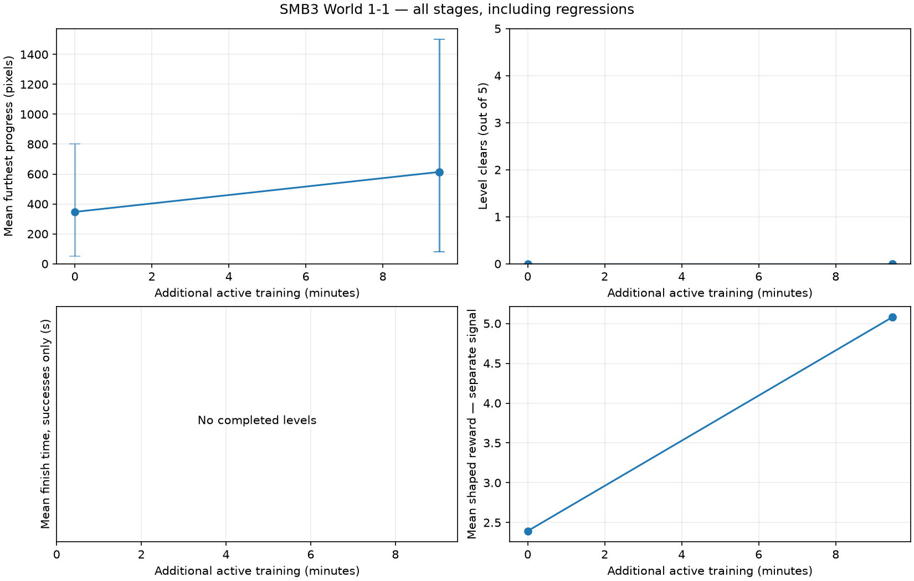
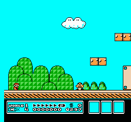
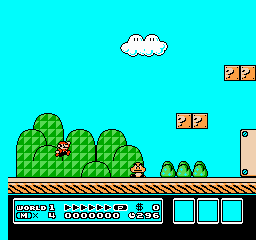
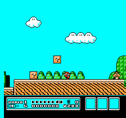

# SMB3 World 1-1 — 2026-09-20-smb3-recovery-pilot

Session status: **completed**. This is a local CPU experiment.

[Classroom learning timeline and stage explanations](LESSON.md) · [Manifest](manifest.json) · [Configuration](config.json) · [Dependencies](requirements.txt)

## Time and work measured

| Measurement | Value |
|---|---:|
| Session wall time before chart generation | 616.60 s |
| Active training | 568.27 s |
| Rollout collection (includes inference and traces) | 344.52 s |
| Raw emulator stepping inside collection | 223.24 s |
| Learning updates | 223.61 s |
| Evaluation subprocesses (includes recording/startup) | 45.54 s |
| Checkpoint saving | 0.10 s |
| Training game frames | 332,420 |
| Agent decisions | 83,348 |
| PPO train calls / optimizer steps | 162 / 4964 |
| Sampled peak RSS | 225.4 MiB (parent_only_fallback_used) |

Nested timing fields overlap: raw stepping is part of collection, and collection/learning are part of active training. RSS is sampled every 100 ms; shared pages may be counted twice. Reset/setup frames are excluded from action-frame counters.

Raw simulation: 1489 frames/s; end-to-end training: 585 frames/s; learning: 22.2 optimizer steps/s.

## Outcomes across stages

Error bars show the range across the five trials, not confidence intervals. Progress is furthest horizontal displacement from the start, in pixels, not a percentage of the level. Completion is measured independently. Finishing time uses action frames / 60, only for completed levels. Training reward is plotted separately and is not a success rate.

## 00-untrained

0.00 additional active minutes. Model SHA-256: `bd94da873e6015e4f89db64ac677fc054a7c634585218d85aa094c867946a341`.

Evaluation **complete**: 5/5 finished trials. [Full measurements](00-untrained/evaluation.json).

**Observed measurements:** 0/5 clears; 5 deaths; mean progress 346.8 pixels (range 49–801); mean shaped reward 2.393.

| Trial | Progress (pixels) | Outcome | Evidence |
|---|---:|---|---|
| 101 | 49 | death | [Trace](00-untrained/trial-101.jsonl) · [beginning](00-untrained/trial-101-beginning.gif) · [ending](00-untrained/trial-101-ending.gif) |
| 202 | 287 | death | [Trace](00-untrained/trial-202.jsonl) · [beginning](00-untrained/trial-202-beginning.gif) · [ending](00-untrained/trial-202-ending.gif) |
| 303 | 801 | death | [Trace](00-untrained/trial-303.jsonl) · [beginning](00-untrained/trial-303-beginning.gif) · [ending](00-untrained/trial-303-ending.gif) |
| 404 | 270 | death | [Trace](00-untrained/trial-404.jsonl) · [beginning](00-untrained/trial-404-beginning.gif) · [ending](00-untrained/trial-404-ending.gif) |
| 505 | 327 | death | [Trace](00-untrained/trial-505.jsonl) · [beginning](00-untrained/trial-505-beginning.gif) · [ending](00-untrained/trial-505-ending.gif) |

| Beginning · seed 101 · decisions 1–84 | Ending · seed 101 · decisions 10–84 |
|---|---|
|  |  |

These excerpts overlap; they are two views of the same trial.

## 01-stage

9.47 additional active minutes. Model SHA-256: `a5364cda88498b0eb67f5b97eeb4de858182a2c3dae64c8a971e39b25ac1233b`.

Evaluation **complete**: 5/5 finished trials. [Full measurements](01-stage/evaluation.json).

**Observed measurements:** 0/5 clears; 5 deaths; mean progress 614.2 pixels (range 82–1500); mean shaped reward 5.079.

Mean progress changed by +267.4 pixels; completion count changed by +0. Improvement is not assumed, and five action samples are a small evaluation.

| Trial | Progress (pixels) | Outcome | Evidence |
|---|---:|---|---|
| 101 | 82 | death | [Trace](01-stage/trial-101.jsonl) · [beginning](01-stage/trial-101-beginning.gif) · [ending](01-stage/trial-101-ending.gif) |
| 202 | 84 | death | [Trace](01-stage/trial-202.jsonl) · [beginning](01-stage/trial-202-beginning.gif) · [ending](01-stage/trial-202-ending.gif) |
| 303 | 1090 | death | [Trace](01-stage/trial-303.jsonl) · [beginning](01-stage/trial-303-beginning.gif) · [ending](01-stage/trial-303-ending.gif) |
| 404 | 315 | death | [Trace](01-stage/trial-404.jsonl) · [beginning](01-stage/trial-404-beginning.gif) · [ending](01-stage/trial-404-ending.gif) |
| 505 | 1500 | death | [Trace](01-stage/trial-505.jsonl) · [beginning](01-stage/trial-505-beginning.gif) · [ending](01-stage/trial-505-ending.gif) |

| Beginning · seed 101 · decisions 1–68 | Ending · seed 101 · decisions 1–68 |
|---|---|
|  |  |

These excerpts overlap; they are two views of the same trial.

## final

9.47 additional active minutes. Model SHA-256: `52b40ac6b6e684bf81df7e777c227d4aab711bc3e2ad03ebaecf0ca84ba7a890`.

Evaluation **complete**: 5/5 finished trials. [Full measurements](final/evaluation.json).

**Observed measurements:** 0/5 clears; 5 deaths; mean progress 614.2 pixels (range 82–1500); mean shaped reward 5.079.

Mean progress changed by +0.0 pixels; completion count changed by +0. Improvement is not assumed, and five action samples are a small evaluation.

| Trial | Progress (pixels) | Outcome | Evidence |
|---|---:|---|---|
| 101 | 82 | death | [Trace](final/trial-101.jsonl) · [beginning](final/trial-101-beginning.gif) · [ending](final/trial-101-ending.gif) |
| 202 | 84 | death | [Trace](final/trial-202.jsonl) · [beginning](final/trial-202-beginning.gif) · [ending](final/trial-202-ending.gif) |
| 303 | 1090 | death | [Trace](final/trial-303.jsonl) · [beginning](final/trial-303-beginning.gif) · [ending](final/trial-303-ending.gif) |
| 404 | 315 | death | [Trace](final/trial-404.jsonl) · [beginning](final/trial-404-beginning.gif) · [ending](final/trial-404-ending.gif) |
| 505 | 1500 | death | [Trace](final/trial-505.jsonl) · [beginning](final/trial-505-beginning.gif) · [ending](final/trial-505-ending.gif) |

| Beginning · seed 101 · decisions 1–68 | Ending · seed 101 · decisions 1–68 |
|---|---|
|  |  |

These excerpts overlap; they are two views of the same trial.

## Run right baseline

Status: complete. [Measurements](hold-run-right/evaluation.json).

0/5 clears; mean progress 88.0 pixels. Additional seeds are action samples on the same level, not unseen levels.

| Trial | Progress (pixels) | Outcome | Evidence |
|---|---:|---|---|
| 101 | 88 | death | [Trace](hold-run-right/trial-101.jsonl) · [beginning](hold-run-right/trial-101-beginning.gif) · [ending](hold-run-right/trial-101-ending.gif) |
| 202 | 88 | death | [Trace](hold-run-right/trial-202.jsonl) · [beginning](hold-run-right/trial-202-beginning.gif) · [ending](hold-run-right/trial-202-ending.gif) |
| 303 | 88 | death | [Trace](hold-run-right/trial-303.jsonl) · [beginning](hold-run-right/trial-303-beginning.gif) · [ending](hold-run-right/trial-303-ending.gif) |
| 404 | 88 | death | [Trace](hold-run-right/trial-404.jsonl) · [beginning](hold-run-right/trial-404-beginning.gif) · [ending](hold-run-right/trial-404-ending.gif) |
| 505 | 88 | death | [Trace](hold-run-right/trial-505.jsonl) · [beginning](hold-run-right/trial-505-beginning.gif) · [ending](hold-run-right/trial-505-ending.gif) |

| Beginning · seed 101 · decisions 1–65 | Ending · seed 101 · decisions 1–65 |
|---|---|
|  |  |

These excerpts overlap; they are two views of the same trial.

## Final additional trials

Status: complete. [Measurements](final-additional-trials/evaluation.json).

0/10 clears; mean progress 571.9 pixels. Additional seeds are action samples on the same level, not unseen levels.

| Trial | Progress (pixels) | Outcome | Evidence |
|---|---:|---|---|
| 6101 | 886 | death | [Trace](final-additional-trials/trial-6101.jsonl) · [beginning](final-additional-trials/trial-6101-beginning.gif) · [ending](final-additional-trials/trial-6101-ending.gif) |
| 6202 | 823 | death | [Trace](final-additional-trials/trial-6202.jsonl) · [beginning](final-additional-trials/trial-6202-beginning.gif) · [ending](final-additional-trials/trial-6202-ending.gif) |
| 6303 | 776 | death | [Trace](final-additional-trials/trial-6303.jsonl) · [beginning](final-additional-trials/trial-6303-beginning.gif) · [ending](final-additional-trials/trial-6303-ending.gif) |
| 6404 | 742 | death | [Trace](final-additional-trials/trial-6404.jsonl) · [beginning](final-additional-trials/trial-6404-beginning.gif) · [ending](final-additional-trials/trial-6404-ending.gif) |
| 6505 | 316 | death | [Trace](final-additional-trials/trial-6505.jsonl) · [beginning](final-additional-trials/trial-6505-beginning.gif) · [ending](final-additional-trials/trial-6505-ending.gif) |
| 6606 | 341 | death | [Trace](final-additional-trials/trial-6606.jsonl) · [beginning](final-additional-trials/trial-6606-beginning.gif) · [ending](final-additional-trials/trial-6606-ending.gif) |
| 6707 | 316 | death | [Trace](final-additional-trials/trial-6707.jsonl) · [beginning](final-additional-trials/trial-6707-beginning.gif) · [ending](final-additional-trials/trial-6707-ending.gif) |
| 6808 | 316 | death | [Trace](final-additional-trials/trial-6808.jsonl) · [beginning](final-additional-trials/trial-6808-beginning.gif) · [ending](final-additional-trials/trial-6808-ending.gif) |
| 6909 | 887 | death | [Trace](final-additional-trials/trial-6909.jsonl) · [beginning](final-additional-trials/trial-6909-beginning.gif) · [ending](final-additional-trials/trial-6909-ending.gif) |
| 7010 | 316 | death | [Trace](final-additional-trials/trial-7010.jsonl) · [beginning](final-additional-trials/trial-7010-beginning.gif) · [ending](final-additional-trials/trial-7010-ending.gif) |

| Beginning · seed 6101 · decisions 1–150 | Ending · seed 6101 · decisions 125–199 |
|---|---|
|  |  |

These excerpts overlap; they are two views of the same trial.

## Recording overhead

- [overhead without recording](overhead-no-record/evaluation.json): complete, 333 frames, 1.980 s total; 0.000 s image handling/encoding.
- [overhead with recording](overhead-record/evaluation.json): complete, 333 frames, 1.844 s total; 0.297 s image handling/encoding.

Matched-trial wall-time difference: -0.136 s. This single pair includes cache and scheduling noise; it is an estimate, not a stable benchmark.

## Interpretation

[Read the visual stage-by-stage analysis](ANALYSIS.md).

[Verified downloadable model checkpoints](MODELS.md) · [Download verification manifest](release.json).
