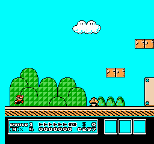
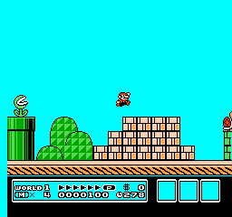

# Final acceptance test — FAILED

**0/20 wins; required: at least 18/20.** All 20 predetermined trials completed with valid telemetry. All ended in death. No learning or parameter changes occurred during this test.

[Predeclared plan](acceptance-plan.json) · [Machine-readable decision](acceptance-result.json) · [Full measurements](acceptance-20/evaluation.json)

The final checkpoint was selected in advance; the acceptance seed set was published before the outcomes were observed. No failed seed was silently retried or replaced. These seeds vary action sampling on the same World 1-1, not level layouts. This result applies to one trained policy; it does not estimate performance across independent training runs.

Mean progress: 1,604.6 pixels; range: 777–2,220. No finishing time exists because there were no wins. The farthest sample (seed 8114, selected by distance) falls in the gap beside the tall pipes; it is not representative proof of success. [Reviewed ending](review/acceptance-farthest.png).

This additional evaluation took 65.42 seconds, including 17.13 seconds of image handling/encoding, with 22,776 action frames and 5,700 decisions. These are separate from the completed training runner’s manifest totals.

| Trial | Progress (pixels) | Outcome | Evidence |
|---|---:|---|---|
| 8101 | 2064 | death | [Trace](acceptance-20/trial-8101.jsonl) · [beginning](acceptance-20/trial-8101-beginning.gif) · [ending](acceptance-20/trial-8101-ending.gif) |
| 8102 | 1820 | death | [Trace](acceptance-20/trial-8102.jsonl) · [beginning](acceptance-20/trial-8102-beginning.gif) · [ending](acceptance-20/trial-8102-ending.gif) |
| 8103 | 1628 | death | [Trace](acceptance-20/trial-8103.jsonl) · [beginning](acceptance-20/trial-8103-beginning.gif) · [ending](acceptance-20/trial-8103-ending.gif) |
| 8104 | 1628 | death | [Trace](acceptance-20/trial-8104.jsonl) · [beginning](acceptance-20/trial-8104-beginning.gif) · [ending](acceptance-20/trial-8104-ending.gif) |
| 8105 | 1629 | death | [Trace](acceptance-20/trial-8105.jsonl) · [beginning](acceptance-20/trial-8105-beginning.gif) · [ending](acceptance-20/trial-8105-ending.gif) |
| 8106 | 1629 | death | [Trace](acceptance-20/trial-8106.jsonl) · [beginning](acceptance-20/trial-8106-beginning.gif) · [ending](acceptance-20/trial-8106-ending.gif) |
| 8107 | 2060 | death | [Trace](acceptance-20/trial-8107.jsonl) · [beginning](acceptance-20/trial-8107-beginning.gif) · [ending](acceptance-20/trial-8107-ending.gif) |
| 8108 | 888 | death | [Trace](acceptance-20/trial-8108.jsonl) · [beginning](acceptance-20/trial-8108-beginning.gif) · [ending](acceptance-20/trial-8108-ending.gif) |
| 8109 | 1380 | death | [Trace](acceptance-20/trial-8109.jsonl) · [beginning](acceptance-20/trial-8109-beginning.gif) · [ending](acceptance-20/trial-8109-ending.gif) |
| 8110 | 777 | death | [Trace](acceptance-20/trial-8110.jsonl) · [beginning](acceptance-20/trial-8110-beginning.gif) · [ending](acceptance-20/trial-8110-ending.gif) |
| 8111 | 1501 | death | [Trace](acceptance-20/trial-8111.jsonl) · [beginning](acceptance-20/trial-8111-beginning.gif) · [ending](acceptance-20/trial-8111-ending.gif) |
| 8112 | 2061 | death | [Trace](acceptance-20/trial-8112.jsonl) · [beginning](acceptance-20/trial-8112-beginning.gif) · [ending](acceptance-20/trial-8112-ending.gif) |
| 8113 | 888 | death | [Trace](acceptance-20/trial-8113.jsonl) · [beginning](acceptance-20/trial-8113-beginning.gif) · [ending](acceptance-20/trial-8113-ending.gif) |
| 8114 | 2220 | death | [Trace](acceptance-20/trial-8114.jsonl) · [beginning](acceptance-20/trial-8114-beginning.gif) · [ending](acceptance-20/trial-8114-ending.gif) |
| 8115 | 1628 | death | [Trace](acceptance-20/trial-8115.jsonl) · [beginning](acceptance-20/trial-8115-beginning.gif) · [ending](acceptance-20/trial-8115-ending.gif) |
| 8116 | 1766 | death | [Trace](acceptance-20/trial-8116.jsonl) · [beginning](acceptance-20/trial-8116-beginning.gif) · [ending](acceptance-20/trial-8116-ending.gif) |
| 8117 | 1628 | death | [Trace](acceptance-20/trial-8117.jsonl) · [beginning](acceptance-20/trial-8117-beginning.gif) · [ending](acceptance-20/trial-8117-ending.gif) |
| 8118 | 1629 | death | [Trace](acceptance-20/trial-8118.jsonl) · [beginning](acceptance-20/trial-8118-beginning.gif) · [ending](acceptance-20/trial-8118-ending.gif) |
| 8119 | 1766 | death | [Trace](acceptance-20/trial-8119.jsonl) · [beginning](acceptance-20/trial-8119-beginning.gif) · [ending](acceptance-20/trial-8119-ending.gif) |
| 8120 | 1502 | death | [Trace](acceptance-20/trial-8120.jsonl) · [beginning](acceptance-20/trial-8120-beginning.gif) · [ending](acceptance-20/trial-8120-ending.gif) |

| Beginning · seed 8101 · decisions 1–150 | Ending · seed 8101 · decisions 290–364 |
|---|---|
|  |  |

The middle of this trial is omitted from these excerpts; the full action trace is retained.

The completion baseline is not established; game-score optimization remains deferred. If settings are tuned using these results, a new predetermined acceptance seed set is required.
