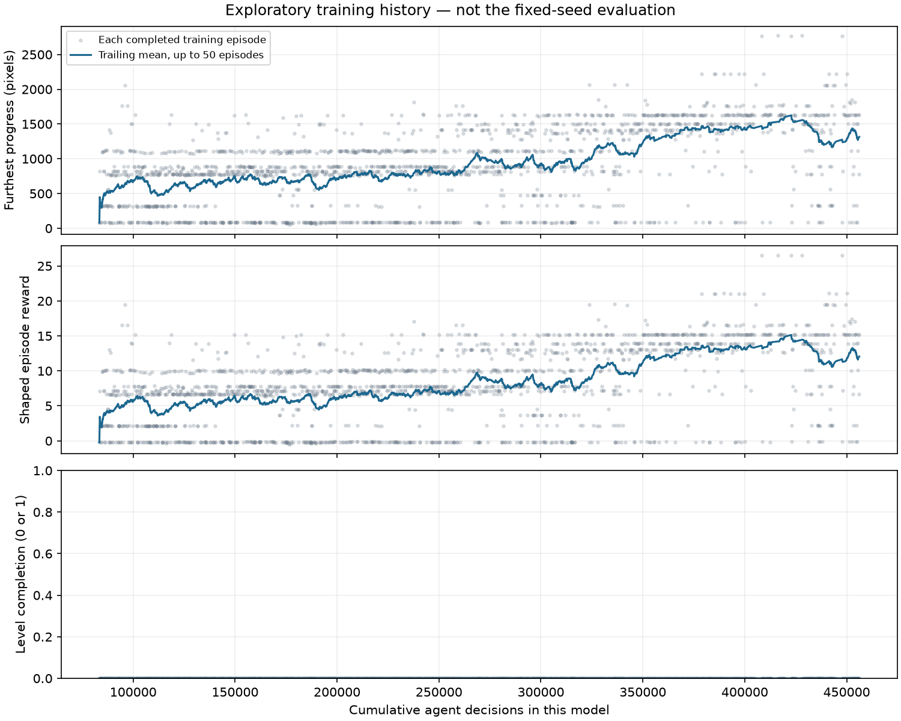

# Seven-action continuation — completed review

The approved hour is complete. No further training has started. This session continues the recovery pilot with unchanged PPO settings and reward. **[Final 20-trial acceptance result](ACCEPTANCE.md)**.

## Timeline

| Additional active minutes | Mean progress | Median | Range | Clears |
|---|---:|---:|---:|---:|
| 0.00 (00-resumed) | 614.2 | 315 | 82–1500 | 0/5 |
| 15.00 (01-stage) | 534.0 | 811 | 75–883 | 0/5 |
| 30.00 (02-stage) | 1316.0 | 1415 | 822–1819 | 0/5 |
| 45.02 (03-stage) | 1448.8 | 1415 | 1413–1501 | 0/5 |
| 60.00 (04-stage) | 1488.6 | 1629 | 327–2221 | 0/5 |
| 60.00 (final) | 1488.6 | 1629 | 327–2221 | 0/5 |

## 00-resumed

**What changed:** The pilot final model and optimizer were resumed, with unchanged configuration. The five outcomes exactly reproduce the prior final evaluation.

**Observed behavior:** Mean progress starts at 614.2 pixels; the pilot clips and visual analysis describe this same policy. [Pilot analysis](../2026-09-20-smb3-recovery-pilot/ANALYSIS.md).

**Remaining failures:** All five trials die; the completion target is not met.

**Limits:** These are five action samples on the same level, not different levels or independent training runs. Clips show trajectories, not what the network understands.

[All measurements and traces](00-resumed/evaluation.json).

## 01-stage

**What changed:** 15 additional active minutes with the same seven actions and reward.

**Observed behavior:** Mean progress falls to 534 pixels. Seed 101 dies near the first walking enemy; seeds 202, 404 and 505 reach the later open enemy area and die. [Reviewed endings](review/01-stage-overview.png).

**Remaining failures:** Seeds 303 and 505 regress by 1,015 and 682 pixels. All five trials die.

**Limits:** These are five action samples on the same level, not different levels or independent training runs. Clips show trajectories, not what the network understands.

[All measurements and traces](01-stage/evaluation.json).

## 02-stage

**What changed:** 30 additional active minutes; no settings changed.

**Observed behavior:** Mean progress recovers to 1,316 pixels and every paired trial gains distance. Seed 202 reaches the later plant pipes; seed 404 reaches the wooden structures. [Reviewed endings](review/02-stage-overview.png).

**Remaining failures:** The reviewed endings show enemy/plant failures and a fall between wooden structures; all five trials die.

**Limits:** These are five action samples on the same level, not different levels or independent training runs. Clips show trajectories, not what the network understands.

[All measurements and traces](02-stage/evaluation.json).

## 03-stage

**What changed:** 45 additional active minutes; the same reward and settings continue.

**Observed behavior:** Mean progress reaches 1,448.8 pixels and outcomes cluster at 1,413–1,501 pixels. Seed 101 reaches the gap before the wooden steps. [Reviewed endings](review/03-stage-overview.png).

**Remaining failures:** Seeds 202 and 404 regress. Reviewed clips show deaths around the flying enemies and falls before the wooden steps; no trial clears.

**Limits:** These are five action samples on the same level, not different levels or independent training runs. Clips show trajectories, not what the network understands.

[All measurements and traces](03-stage/evaluation.json).

## 04-stage

**What changed:** 60 additional active minutes; the approved training budget is exhausted.

**Observed behavior:** Mean progress is 1,488.6 pixels. Seed 101 reaches the later plant pipes and seed 505 reaches the tall-pipe gap. [Reviewed endings](review/04-stage-overview.png).

**Remaining failures:** Seed 404 regresses from 1,415 to 327 pixels and dies near the first plant pipe. Seed 202 falls before the wooden steps. All five trials die.

**Limits:** These are five action samples on the same level, not different levels or independent training runs. Clips show trajectories, not what the network understands.

[All measurements and traces](04-stage/evaluation.json).

## final

**What changed:** No learning occurred after 04-stage; the final save has identical policy weights and repeated five-seed results.

**Observed behavior:** Ten additional diagnostic seeds average 1,410.7 pixels. Seed 6404 reaches the goal area but stays to the right of the uncollected card until the frame limit. [Goal timeout](final-additional-trials/trial-6404-ending.gif).

**Remaining failures:** The extra ten trials yield nine deaths and one timeout, 0/10 clears. Left controls are available but purposeful missed-card recovery is not demonstrated. [20-trial acceptance result](ACCEPTANCE.md).

**Limits:** These are five action samples on the same level, not different levels or independent training runs. Clips show trajectories, not what the network understands.

[All measurements and traces](final/evaluation.json).

## Does Mario use backward controls to recover?

The goal-area timeout is particularly informative. In seed 6404, the final 750 decisions keep world x between 2791 and 2793. Only 25 of those decisions use left or left-jump, while 704 use a rightward action and 21 coast. The [clip](final-additional-trials/trial-6404-ending.gif) shows the goal card still to Mario’s left. The controls permit recovery, as scripted validation established, but this trial does not execute enough sustained return movement. This does not prove that the model is “figuring out backward movement”; it is an observed failure to recover. [Full trace](final-additional-trials/trial-6404.jsonl).

The high-water reward gives no new progress reward for returning through visited territory. That may make recovery harder to discover, but it is a hypothesis rather than an established cause. Do not switch to score optimization: the completion target is not met. Before another large run, investigate a controlled completion-focused intervention, such as a separately documented goal-area curriculum or a stronger completion incentive, with tests for reward exploits. No such change or extra training has been launched.

## Timing and exploratory training

The training trace contains 1,845 completed episodes, no clears, and maximum progress 2,770 pixels; a trailing 155-decision partial episode is excluded from the episode chart. These changing-policy episodes are not independent evaluations. The hold-run-right baseline remains 0/5 clears at 88 pixels.

Active training: 3600.006 seconds; runner wall time: 3738.60; evaluation subprocesses: 136.32; collection: 2468.86, including 1578.20 of emulator stepping; learning: 1129.45. Nested times overlap. This collected 1,489,007 action frames / 372,975 decisions and made 727 PPO train calls / 14,931 optimizer steps.

Sampled parent-only peak RSS: 336.41 MiB; macOS blocked child enumeration. Simulation measured 943.5 frames/s; end-to-end active training 413.6 frames/s. A separate GIF viewer was added during the run; its overhead was not isolated and is not included in parent-only RSS. Machine load may affect throughput, so wall-clock comparisons with earlier sessions do not isolate algorithm efficiency.

The final stage and final save have identical policy SHA-256 `107de2dd5289c3810e0d781f2f466f1f4286cfc5545d05ee5ea4f9e3cc7dc359`. Both are retained, not counted as independent learning. The acceptance evaluation is a later, separate frozen-policy measurement; its wall time is reported in ACCEPTANCE.md and is not added retroactively to runner manifest totals.
