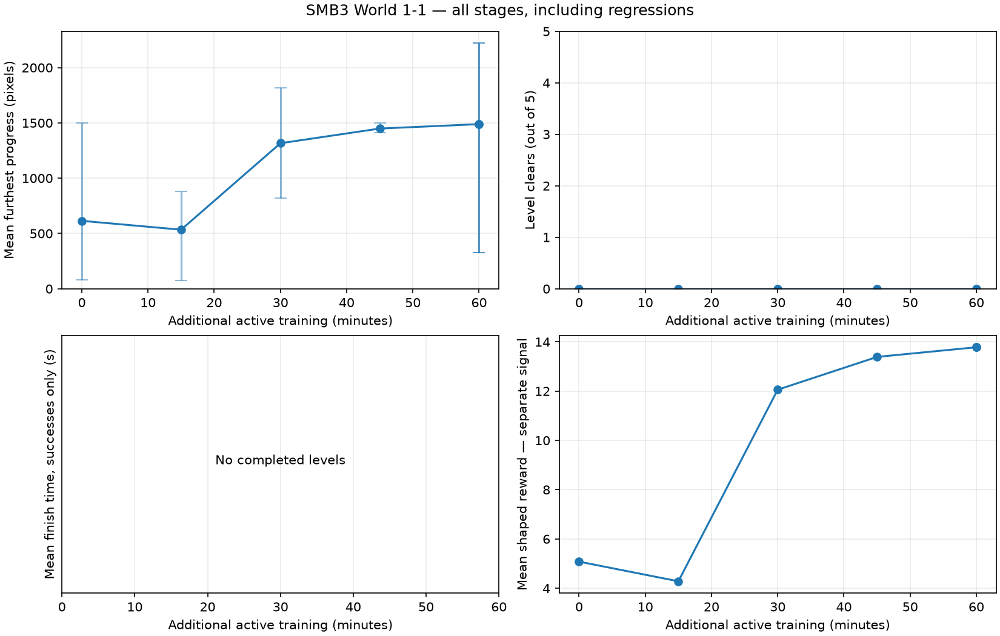
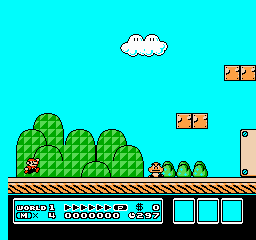
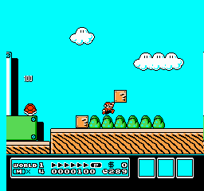
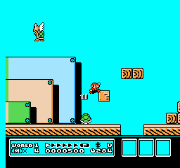
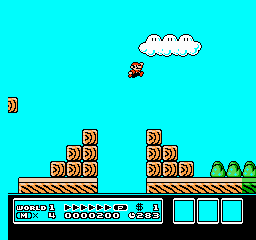

# Watching Mario learn — Super Mario Bros. 3

## Use this in class

1. Watch the initial policy and predict where Mario will fail.
2. Compare the same seed’s beginning and ending at each checkpoint.
3. Check your impression against every trial, including regressions.
4. Separate what the clips show from hypotheses about why it happened.

[Detailed measurements and all trials](REPORT.md) · [Visual analysis](ANALYSIS.md)

## Learning timeline

Longer sessions save checkpoints approximately every **15 minutes of additional active training**, plus the initial and final models. Evaluation and recording time are measured separately. The table uses actual times, not rounded checkpoint targets. Seeds change sampled actions on the same World 1-1; they do not create new levels.

| Stage | Active minutes in this session | Cumulative model decisions | Mean progress | Median | Min–max | Clears |
|---|---:|---:|---:|---:|---:|---:|
| Initial policy | 0.00 | 83,348 | 614.2 | 315.0 | 82–1500 | 0/5 |
| 01-stage | 15.00 | 178,729 | 534.0 | 811.0 | 75–883 | 0/5 |
| 02-stage | 30.00 | 238,791 | 1316.0 | 1415.0 | 822–1819 | 0/5 |
| 03-stage | 45.02 | 353,992 | 1448.8 | 1415.0 | 1413–1501 | 0/5 |
| 04-stage | 60.00 | 456,323 | 1488.6 | 1629.0 | 327–2221 | 0/5 |
| Final saved policy | 60.00 | 456,323 | 1488.6 | 1629.0 | 327–2221 | 0/5 |

Progress is furthest horizontal displacement in pixels, not a completion percentage. Missing or incompatible evaluations are excluded, never scored as zero. Cumulative model decisions include previous sessions when resuming.

Range bars show trial variability, not confidence intervals. Reward is a separate training signal; it does not establish successful play.

## Initial policy · 0.00 active minutes

Saved stage: `00-resumed`. Model identifier: `df8af96c1d6cb61deb4d340575d3dcb5e56663044128b0a8c3fe6caf8dfee614`.

**What changed:** The pilot final model and optimizer were resumed, with unchanged configuration. The five outcomes exactly reproduce the prior final evaluation.

**What visibly improved or happened:** Mean progress starts at 614.2 pixels; the pilot clips and visual analysis describe this same policy. [Pilot analysis](../2026-09-20-smb3-recovery-pilot/ANALYSIS.md).

**What still fails:** All five trials die; the completion target is not met.

**Hypotheses and limits:** These are five action samples on the same level, not different levels or independent training runs. Clips show trajectories, not what the network understands.

| Beginning · seed 101 · decisions 1–68 | Ending · seed 101 · decisions 1–68 |
|---|---|
|  |  |

These excerpts overlap; they are two views of the same trial.

[All trial measurements](00-resumed/evaluation.json) · [Every trial’s clips and traces](REPORT.md)

**Discuss:** What changed visibly? Did every trial improve? What extra evidence would distinguish better jump timing from a favorable action sequence?

## 01-stage · 15.00 active minutes

Saved stage: `01-stage`. Model identifier: `644aad243c0f8c2ed09e3f5590032d666cd3765dd25521104dedfdf4b497f3a2`.

**Measured change:** mean progress -80.2 pixels; 0/5 level clears.

| Seed | Progress change since previous stage |
|---|---:|
| 101 | +1 |
| 202 | +799 |
| 303 | -1015 · regression |
| 404 | +496 |
| 505 | -682 · regression |

Paired seeds are reproducible comparisons, but changed policies can consume randomness differently. Five trials cannot establish reliability.

**What changed:** 15 additional active minutes with the same seven actions and reward.

**What visibly improved or happened:** Mean progress falls to 534 pixels. Seed 101 dies near the first walking enemy; seeds 202, 404 and 505 reach the later open enemy area and die. [Reviewed endings](review/01-stage-overview.png).

**What still fails:** Seeds 303 and 505 regress by 1,015 and 682 pixels. All five trials die.

**Hypotheses and limits:** These are five action samples on the same level, not different levels or independent training runs. Clips show trajectories, not what the network understands.

| Beginning · seed 101 · decisions 1–67 | Ending · seed 101 · decisions 1–67 |
|---|---|
|  |  |

These excerpts overlap; they are two views of the same trial.

[All trial measurements](01-stage/evaluation.json) · [Every trial’s clips and traces](REPORT.md)

**Discuss:** What changed visibly? Did every trial improve? What extra evidence would distinguish better jump timing from a favorable action sequence?

## 02-stage · 30.00 active minutes

Saved stage: `02-stage`. Model identifier: `0c52c5f2ab5d4844069afd77381a915d21706f77984d16758b850eeea1dab1d5`.

**Measured change:** mean progress +782.0 pixels; 0/5 level clears.

| Seed | Progress change since previous stage |
|---|---:|
| 101 | +805 |
| 202 | +936 |
| 303 | +747 |
| 404 | +825 |
| 505 | +597 |

Paired seeds are reproducible comparisons, but changed policies can consume randomness differently. Five trials cannot establish reliability.

**What changed:** 30 additional active minutes; no settings changed.

**What visibly improved or happened:** Mean progress recovers to 1,316 pixels and every paired trial gains distance. Seed 202 reaches the later plant pipes; seed 404 reaches the wooden structures. [Reviewed endings](review/02-stage-overview.png).

**What still fails:** The reviewed endings show enemy/plant failures and a fall between wooden structures; all five trials die.

**Hypotheses and limits:** These are five action samples on the same level, not different levels or independent training runs. Clips show trajectories, not what the network understands.

| Beginning · seed 101 · decisions 1–150 | Ending · seed 101 · decisions 111–185 |
|---|---|
|  |  |

These excerpts overlap; they are two views of the same trial.

[All trial measurements](02-stage/evaluation.json) · [Every trial’s clips and traces](REPORT.md)

**Discuss:** What changed visibly? Did every trial improve? What extra evidence would distinguish better jump timing from a favorable action sequence?

## 03-stage · 45.02 active minutes

Saved stage: `03-stage`. Model identifier: `c5e0c7486c2c4aaab14200ab434fb5dd9dc48427e4389004d190967fc3627622`.

**Measured change:** mean progress +132.8 pixels; 0/5 level clears.

| Seed | Progress change since previous stage |
|---|---:|
| 101 | +613 |
| 202 | -404 · regression |
| 303 | +591 |
| 404 | -221 · regression |
| 505 | +85 |

Paired seeds are reproducible comparisons, but changed policies can consume randomness differently. Five trials cannot establish reliability.

**What changed:** 45 additional active minutes; the same reward and settings continue.

**What visibly improved or happened:** Mean progress reaches 1,448.8 pixels and outcomes cluster at 1,413–1,501 pixels. Seed 101 reaches the gap before the wooden steps. [Reviewed endings](review/03-stage-overview.png).

**What still fails:** Seeds 202 and 404 regress. Reviewed clips show deaths around the flying enemies and falls before the wooden steps; no trial clears.

**Hypotheses and limits:** These are five action samples on the same level, not different levels or independent training runs. Clips show trajectories, not what the network understands.

| Beginning · seed 101 · decisions 1–150 | Ending · seed 101 · decisions 199–273 |
|---|---|
|  |  |

The middle of this trial is omitted from these excerpts; the full action trace is retained.

[All trial measurements](03-stage/evaluation.json) · [Every trial’s clips and traces](REPORT.md)

**Discuss:** What changed visibly? Did every trial improve? What extra evidence would distinguish better jump timing from a favorable action sequence?

## 04-stage · 60.00 active minutes

Saved stage: `04-stage`. Model identifier: `f7dcf12e95fc12c78519084b26e9e08a391069df66a9a47237b3ce2b7015e0df`.

**Measured change:** mean progress +39.8 pixels; 0/5 level clears.

| Seed | Progress change since previous stage |
|---|---:|
| 101 | +265 |
| 202 | +85 |
| 303 | +216 |
| 404 | -1088 · regression |
| 505 | +721 |

Paired seeds are reproducible comparisons, but changed policies can consume randomness differently. Five trials cannot establish reliability.

**What changed:** 60 additional active minutes; the approved training budget is exhausted.

**What visibly improved or happened:** Mean progress is 1,488.6 pixels. Seed 101 reaches the later plant pipes and seed 505 reaches the tall-pipe gap. [Reviewed endings](review/04-stage-overview.png).

**What still fails:** Seed 404 regresses from 1,415 to 327 pixels and dies near the first plant pipe. Seed 202 falls before the wooden steps. All five trials die.

**Hypotheses and limits:** These are five action samples on the same level, not different levels or independent training runs. Clips show trajectories, not what the network understands.

| Beginning · seed 101 · decisions 1–150 | Ending · seed 101 · decisions 217–291 |
|---|---|
|  |  |

The middle of this trial is omitted from these excerpts; the full action trace is retained.

[All trial measurements](04-stage/evaluation.json) · [Every trial’s clips and traces](REPORT.md)

**Discuss:** What changed visibly? Did every trial improve? What extra evidence would distinguish better jump timing from a favorable action sequence?

## Final saved policy · 60.00 active minutes

Saved stage: `final`. Model identifier: `9db36aabfb0a28f1916e8096ae7d580776007ecaa7a8396973a75bf694da4003`.

**Measured change:** mean progress +0.0 pixels; 0/5 level clears.

| Seed | Progress change since previous stage |
|---|---:|
| 101 | +0 |
| 202 | +0 |
| 303 | +0 |
| 404 | +0 |
| 505 | +0 |

Paired seeds are reproducible comparisons, but changed policies can consume randomness differently. Five trials cannot establish reliability.

**What changed:** No learning occurred after 04-stage; the final save has identical policy weights and repeated five-seed results.

**What visibly improved or happened:** Ten additional diagnostic seeds average 1,410.7 pixels. Seed 6404 reaches the goal area but stays to the right of the uncollected card until the frame limit. [Goal timeout](final-additional-trials/trial-6404-ending.gif).

**What still fails:** The extra ten trials yield nine deaths and one timeout, 0/10 clears. Left controls are available but purposeful missed-card recovery is not demonstrated. [20-trial acceptance result](ACCEPTANCE.md).

**Hypotheses and limits:** These are five action samples on the same level, not different levels or independent training runs. Clips show trajectories, not what the network understands.

| Beginning · seed 101 · decisions 1–150 | Ending · seed 101 · decisions 217–291 |
|---|---|
|  |  |

The middle of this trial is omitted from these excerpts; the full action trace is retained.

[All trial measurements](final/evaluation.json) · [Every trial’s clips and traces](REPORT.md)

**Discuss:** What changed visibly? Did every trial improve? What extra evidence would distinguish better jump timing from a favorable action sequence?

## Read the failures, too

The detailed report preserves the hold-run-right baseline and the final additional-seed evaluation. Additional seeds test action variation on this same level, not generalization to unseen levels. A final save at the same training time is not another learning interval.

Regenerate this page locally with `python -m smb3_rl.report sessions/SESSION_ID`. Reviewed explanations live in `stage-notes.json`, keyed to the checkpoint hash; generation preserves them and refuses to reuse notes for another model. Future stages are explicitly marked pending visual review until their saved evidence has been inspected.

