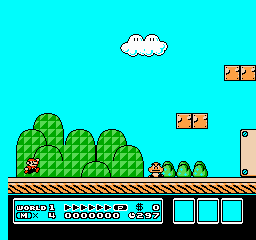
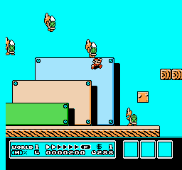

# SMB3 World 1-1 — 2026-09-20-smb3-recovery-session-02

Session status: **completed**. This is a local CPU experiment.

[Classroom learning timeline and stage explanations](LESSON.md) · [Manifest](manifest.json) · [Configuration](config.json) · [Dependencies](requirements.txt)

## Time and work measured

| Measurement | Value |
|---|---:|
| Session wall time before chart generation | 3738.60 s |
| Active training | 3600.01 s |
| Rollout collection (includes inference and traces) | 2468.86 s |
| Raw emulator stepping inside collection | 1578.20 s |
| Learning updates | 1129.45 s |
| Evaluation subprocesses (includes recording/startup) | 136.32 s |
| Checkpoint saving | 0.40 s |
| Training game frames | 1,489,007 |
| Agent decisions | 372,975 |
| PPO train calls / optimizer steps | 727 / 14931 |
| Sampled peak RSS | 336.4 MiB (parent_only_fallback_used) |

Nested timing fields overlap: raw stepping is part of collection, and collection/learning are part of active training. RSS is sampled every 100 ms; shared pages may be counted twice. Reset/setup frames are excluded from action-frame counters.

Raw simulation: 943 frames/s; end-to-end training: 414 frames/s; learning: 13.2 optimizer steps/s.

## Outcomes across stages

Error bars show the range across the five trials, not confidence intervals. Progress is furthest horizontal displacement from the start, in pixels, not a percentage of the level. Completion is measured independently. Finishing time uses action frames / 60, only for completed levels. Training reward is plotted separately and is not a success rate.

## 00-resumed

0.00 additional active minutes. Model SHA-256: `df8af96c1d6cb61deb4d340575d3dcb5e56663044128b0a8c3fe6caf8dfee614`.

Evaluation **complete**: 5/5 finished trials. [Full measurements](00-resumed/evaluation.json).

**Observed measurements:** 0/5 clears; 5 deaths; mean progress 614.2 pixels (range 82–1500); mean shaped reward 5.079.

| Trial | Progress (pixels) | Outcome | Evidence |
|---|---:|---|---|
| 101 | 82 | death | [Trace](00-resumed/trial-101.jsonl) · [beginning](00-resumed/trial-101-beginning.gif) · [ending](00-resumed/trial-101-ending.gif) |
| 202 | 84 | death | [Trace](00-resumed/trial-202.jsonl) · [beginning](00-resumed/trial-202-beginning.gif) · [ending](00-resumed/trial-202-ending.gif) |
| 303 | 1090 | death | [Trace](00-resumed/trial-303.jsonl) · [beginning](00-resumed/trial-303-beginning.gif) · [ending](00-resumed/trial-303-ending.gif) |
| 404 | 315 | death | [Trace](00-resumed/trial-404.jsonl) · [beginning](00-resumed/trial-404-beginning.gif) · [ending](00-resumed/trial-404-ending.gif) |
| 505 | 1500 | death | [Trace](00-resumed/trial-505.jsonl) · [beginning](00-resumed/trial-505-beginning.gif) · [ending](00-resumed/trial-505-ending.gif) |

| Beginning · seed 101 · decisions 1–68 | Ending · seed 101 · decisions 1–68 |
|---|---|
|  |  |

These excerpts overlap; they are two views of the same trial.

## 01-stage

15.00 additional active minutes. Model SHA-256: `644aad243c0f8c2ed09e3f5590032d666cd3765dd25521104dedfdf4b497f3a2`.

Evaluation **complete**: 5/5 finished trials. [Full measurements](01-stage/evaluation.json).

**Observed measurements:** 0/5 clears; 5 deaths; mean progress 534.0 pixels (range 75–883); mean shaped reward 4.281.

Mean progress changed by -80.2 pixels; completion count changed by +0. Improvement is not assumed, and five action samples are a small evaluation.

| Trial | Progress (pixels) | Outcome | Evidence |
|---|---:|---|---|
| 101 | 83 | death | [Trace](01-stage/trial-101.jsonl) · [beginning](01-stage/trial-101-beginning.gif) · [ending](01-stage/trial-101-ending.gif) |
| 202 | 883 | death | [Trace](01-stage/trial-202.jsonl) · [beginning](01-stage/trial-202-beginning.gif) · [ending](01-stage/trial-202-ending.gif) |
| 303 | 75 | death | [Trace](01-stage/trial-303.jsonl) · [beginning](01-stage/trial-303-beginning.gif) · [ending](01-stage/trial-303-ending.gif) |
| 404 | 811 | death | [Trace](01-stage/trial-404.jsonl) · [beginning](01-stage/trial-404-beginning.gif) · [ending](01-stage/trial-404-ending.gif) |
| 505 | 818 | death | [Trace](01-stage/trial-505.jsonl) · [beginning](01-stage/trial-505-beginning.gif) · [ending](01-stage/trial-505-ending.gif) |

| Beginning · seed 101 · decisions 1–67 | Ending · seed 101 · decisions 1–67 |
|---|---|
|  |  |

These excerpts overlap; they are two views of the same trial.

## 02-stage

30.00 additional active minutes. Model SHA-256: `0c52c5f2ab5d4844069afd77381a915d21706f77984d16758b850eeea1dab1d5`.

Evaluation **complete**: 5/5 finished trials. [Full measurements](02-stage/evaluation.json).

**Observed measurements:** 0/5 clears; 5 deaths; mean progress 1316.0 pixels (range 822–1819); mean shaped reward 12.058.

Mean progress changed by +782.0 pixels; completion count changed by +0. Improvement is not assumed, and five action samples are a small evaluation.

| Trial | Progress (pixels) | Outcome | Evidence |
|---|---:|---|---|
| 101 | 888 | death | [Trace](02-stage/trial-101.jsonl) · [beginning](02-stage/trial-101-beginning.gif) · [ending](02-stage/trial-101-ending.gif) |
| 202 | 1819 | death | [Trace](02-stage/trial-202.jsonl) · [beginning](02-stage/trial-202-beginning.gif) · [ending](02-stage/trial-202-ending.gif) |
| 303 | 822 | death | [Trace](02-stage/trial-303.jsonl) · [beginning](02-stage/trial-303-beginning.gif) · [ending](02-stage/trial-303-ending.gif) |
| 404 | 1636 | death | [Trace](02-stage/trial-404.jsonl) · [beginning](02-stage/trial-404-beginning.gif) · [ending](02-stage/trial-404-ending.gif) |
| 505 | 1415 | death | [Trace](02-stage/trial-505.jsonl) · [beginning](02-stage/trial-505-beginning.gif) · [ending](02-stage/trial-505-ending.gif) |

| Beginning · seed 101 · decisions 1–150 | Ending · seed 101 · decisions 111–185 |
|---|---|
|  |  |

These excerpts overlap; they are two views of the same trial.

## 03-stage

45.02 additional active minutes. Model SHA-256: `c5e0c7486c2c4aaab14200ab434fb5dd9dc48427e4389004d190967fc3627622`.

Evaluation **complete**: 5/5 finished trials. [Full measurements](03-stage/evaluation.json).

**Observed measurements:** 0/5 clears; 5 deaths; mean progress 1448.8 pixels (range 1413–1501); mean shaped reward 13.390.

Mean progress changed by +132.8 pixels; completion count changed by +0. Improvement is not assumed, and five action samples are a small evaluation.

| Trial | Progress (pixels) | Outcome | Evidence |
|---|---:|---|---|
| 101 | 1501 | death | [Trace](03-stage/trial-101.jsonl) · [beginning](03-stage/trial-101-beginning.gif) · [ending](03-stage/trial-101-ending.gif) |
| 202 | 1415 | death | [Trace](03-stage/trial-202.jsonl) · [beginning](03-stage/trial-202-beginning.gif) · [ending](03-stage/trial-202-ending.gif) |
| 303 | 1413 | death | [Trace](03-stage/trial-303.jsonl) · [beginning](03-stage/trial-303-beginning.gif) · [ending](03-stage/trial-303-ending.gif) |
| 404 | 1415 | death | [Trace](03-stage/trial-404.jsonl) · [beginning](03-stage/trial-404-beginning.gif) · [ending](03-stage/trial-404-ending.gif) |
| 505 | 1500 | death | [Trace](03-stage/trial-505.jsonl) · [beginning](03-stage/trial-505-beginning.gif) · [ending](03-stage/trial-505-ending.gif) |

| Beginning · seed 101 · decisions 1–150 | Ending · seed 101 · decisions 199–273 |
|---|---|
|  |  |

The middle of this trial is omitted from these excerpts; the full action trace is retained.

## 04-stage

60.00 additional active minutes. Model SHA-256: `f7dcf12e95fc12c78519084b26e9e08a391069df66a9a47237b3ce2b7015e0df`.

Evaluation **complete**: 5/5 finished trials. [Full measurements](04-stage/evaluation.json).

**Observed measurements:** 0/5 clears; 5 deaths; mean progress 1488.6 pixels (range 327–2221); mean shaped reward 13.782.

Mean progress changed by +39.8 pixels; completion count changed by +0. Improvement is not assumed, and five action samples are a small evaluation.

| Trial | Progress (pixels) | Outcome | Evidence |
|---|---:|---|---|
| 101 | 1766 | death | [Trace](04-stage/trial-101.jsonl) · [beginning](04-stage/trial-101-beginning.gif) · [ending](04-stage/trial-101-ending.gif) |
| 202 | 1500 | death | [Trace](04-stage/trial-202.jsonl) · [beginning](04-stage/trial-202-beginning.gif) · [ending](04-stage/trial-202-ending.gif) |
| 303 | 1629 | death | [Trace](04-stage/trial-303.jsonl) · [beginning](04-stage/trial-303-beginning.gif) · [ending](04-stage/trial-303-ending.gif) |
| 404 | 327 | death | [Trace](04-stage/trial-404.jsonl) · [beginning](04-stage/trial-404-beginning.gif) · [ending](04-stage/trial-404-ending.gif) |
| 505 | 2221 | death | [Trace](04-stage/trial-505.jsonl) · [beginning](04-stage/trial-505-beginning.gif) · [ending](04-stage/trial-505-ending.gif) |

| Beginning · seed 101 · decisions 1–150 | Ending · seed 101 · decisions 217–291 |
|---|---|
|  |  |

The middle of this trial is omitted from these excerpts; the full action trace is retained.

## final

60.00 additional active minutes. Model SHA-256: `9db36aabfb0a28f1916e8096ae7d580776007ecaa7a8396973a75bf694da4003`.

Evaluation **complete**: 5/5 finished trials. [Full measurements](final/evaluation.json).

**Observed measurements:** 0/5 clears; 5 deaths; mean progress 1488.6 pixels (range 327–2221); mean shaped reward 13.782.

Mean progress changed by +0.0 pixels; completion count changed by +0. Improvement is not assumed, and five action samples are a small evaluation.

| Trial | Progress (pixels) | Outcome | Evidence |
|---|---:|---|---|
| 101 | 1766 | death | [Trace](final/trial-101.jsonl) · [beginning](final/trial-101-beginning.gif) · [ending](final/trial-101-ending.gif) |
| 202 | 1500 | death | [Trace](final/trial-202.jsonl) · [beginning](final/trial-202-beginning.gif) · [ending](final/trial-202-ending.gif) |
| 303 | 1629 | death | [Trace](final/trial-303.jsonl) · [beginning](final/trial-303-beginning.gif) · [ending](final/trial-303-ending.gif) |
| 404 | 327 | death | [Trace](final/trial-404.jsonl) · [beginning](final/trial-404-beginning.gif) · [ending](final/trial-404-ending.gif) |
| 505 | 2221 | death | [Trace](final/trial-505.jsonl) · [beginning](final/trial-505-beginning.gif) · [ending](final/trial-505-ending.gif) |

| Beginning · seed 101 · decisions 1–150 | Ending · seed 101 · decisions 217–291 |
|---|---|
|  |  |

The middle of this trial is omitted from these excerpts; the full action trace is retained.

## Run right baseline

Status: complete. [Measurements](hold-run-right/evaluation.json).

0/5 clears; mean progress 88.0 pixels. Additional seeds are action samples on the same level, not unseen levels.

| Trial | Progress (pixels) | Outcome | Evidence |
|---|---:|---|---|
| 101 | 88 | death | [Trace](hold-run-right/trial-101.jsonl) · [beginning](hold-run-right/trial-101-beginning.gif) · [ending](hold-run-right/trial-101-ending.gif) |
| 202 | 88 | death | [Trace](hold-run-right/trial-202.jsonl) · [beginning](hold-run-right/trial-202-beginning.gif) · [ending](hold-run-right/trial-202-ending.gif) |
| 303 | 88 | death | [Trace](hold-run-right/trial-303.jsonl) · [beginning](hold-run-right/trial-303-beginning.gif) · [ending](hold-run-right/trial-303-ending.gif) |
| 404 | 88 | death | [Trace](hold-run-right/trial-404.jsonl) · [beginning](hold-run-right/trial-404-beginning.gif) · [ending](hold-run-right/trial-404-ending.gif) |
| 505 | 88 | death | [Trace](hold-run-right/trial-505.jsonl) · [beginning](hold-run-right/trial-505-beginning.gif) · [ending](hold-run-right/trial-505-ending.gif) |

| Beginning · seed 101 · decisions 1–65 | Ending · seed 101 · decisions 1–65 |
|---|---|
|  |  |

These excerpts overlap; they are two views of the same trial.

## Final additional trials

Status: complete. [Measurements](final-additional-trials/evaluation.json).

0/10 clears; mean progress 1410.7 pixels. Additional seeds are action samples on the same level, not unseen levels.

| Trial | Progress (pixels) | Outcome | Evidence |
|---|---:|---|---|
| 6101 | 1500 | death | [Trace](final-additional-trials/trial-6101.jsonl) · [beginning](final-additional-trials/trial-6101-beginning.gif) · [ending](final-additional-trials/trial-6101-ending.gif) |
| 6202 | 1756 | death | [Trace](final-additional-trials/trial-6202.jsonl) · [beginning](final-additional-trials/trial-6202-beginning.gif) · [ending](final-additional-trials/trial-6202-ending.gif) |
| 6303 | 2060 | death | [Trace](final-additional-trials/trial-6303.jsonl) · [beginning](final-additional-trials/trial-6303-beginning.gif) · [ending](final-additional-trials/trial-6303-ending.gif) |
| 6404 | 2769 | frame_limit | [Trace](final-additional-trials/trial-6404.jsonl) · [beginning](final-additional-trials/trial-6404-beginning.gif) · [ending](final-additional-trials/trial-6404-ending.gif) |
| 6505 | 1779 | death | [Trace](final-additional-trials/trial-6505.jsonl) · [beginning](final-additional-trials/trial-6505-beginning.gif) · [ending](final-additional-trials/trial-6505-ending.gif) |
| 6606 | 327 | death | [Trace](final-additional-trials/trial-6606.jsonl) · [beginning](final-additional-trials/trial-6606-beginning.gif) · [ending](final-additional-trials/trial-6606-ending.gif) |
| 6707 | 1629 | death | [Trace](final-additional-trials/trial-6707.jsonl) · [beginning](final-additional-trials/trial-6707-beginning.gif) · [ending](final-additional-trials/trial-6707-ending.gif) |
| 6808 | 326 | death | [Trace](final-additional-trials/trial-6808.jsonl) · [beginning](final-additional-trials/trial-6808-beginning.gif) · [ending](final-additional-trials/trial-6808-ending.gif) |
| 6909 | 328 | death | [Trace](final-additional-trials/trial-6909.jsonl) · [beginning](final-additional-trials/trial-6909-beginning.gif) · [ending](final-additional-trials/trial-6909-ending.gif) |
| 7010 | 1633 | death | [Trace](final-additional-trials/trial-7010.jsonl) · [beginning](final-additional-trials/trial-7010-beginning.gif) · [ending](final-additional-trials/trial-7010-ending.gif) |

| Beginning · seed 6101 · decisions 1–150 | Ending · seed 6101 · decisions 152–226 |
|---|---|
|  |  |

The middle of this trial is omitted from these excerpts; the full action trace is retained.

## Recording overhead

## Interpretation

[Read the visual stage-by-stage analysis](ANALYSIS.md).

[Verified downloadable model checkpoints](MODELS.md) · [Download verification manifest](release.json).
