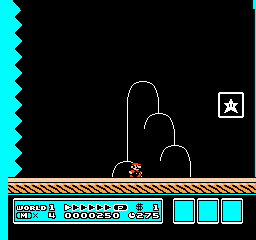

# Seven-action SMB3 recovery validation

[Checks and environment fingerprints](validation.json) · [Configuration](config.json) · [First failed validation attempt](../2026-09-20-smb3-recovery-validation/REPORT.md).

The five original actions retain their indices. Two new actions are **walk left** and **jump left**. PPO will start fresh with seven outputs. The observation stack, reward, PPO hyperparameters, frame repeat and episode cutoff are unchanged.

## Tested recovery from the previously missed goal card

The test replays the first 400 decisions of the archived final policy’s seed 303 trial. Mario reaches x=2792 with the card still uncollected. The scripted controller then walks left for 20 decisions, releases controls for five decisions, and runs/jumps right. The test clears at decision 524. The reviewed frames show the card disappear followed by **COURSE CLEAR**; termination telemetry matches the validated map-return coordinates.

[Contact sheet](recovery-contact-sheet.png) · [Full action sequence](recovery-actions.json) · [Full trace](recovery-trace.json).

This demonstrates that recovery is possible with the expanded controls. It is **not a PPO achievement**, and the scripted actions are not training demonstrations. Initial shorter recovery probes did not clear the level; the successful sequence includes enough time for collection and the completion transition.

## Other checks

Ten seeded resets and replays are identical. Left controls reduce world x; left-jump also changes vertical position. Backtracking decisions with no new high-water progress earn no positive reward. The original death-fadeout regression remains a death, the normal goal replay still clears, and timeout stops on the exact frame. Pixel shape and Gymnasium API checks pass.

The first real-backtracking check had a test-selection bug caused by momentum. Its failed output is preserved; the corrected test compares each decision’s high-water mark to the immediately preceding value. No reward or emulator-adapter code changed.
