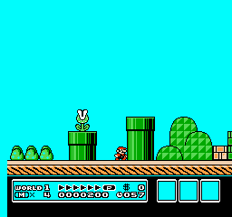

# Safely stopped: telemetry failure after 65.80 training minutes

**This experiment failed before its six-hour limit. It is not still running.** The runner stopped at 01:51 a.m. local time on September 21, 2026 and saved an emergency model. The last completed checkpoint evaluation was at 60 active minutes, with 0/5 clears. No final 20-trial acceptance evaluation ran; the 18/20 target remains unverified. The emergency checkpoint is unevaluated and is retained for diagnosis, not recommended as a validated model.

## What triggered the stop

The final full-start episode reports x=1843 at frame 10,760 and x=1588 at frame 10,762, while reporting that Mario remains in-level and alive. The horizontal page changes from 7 to 6 while the screen coordinate changes from 51 to 52. The adapter rejects implausible frame-to-frame jumps instead of allowing an untrusted progress reward. [Trace tail](review/failure-trace-tail.json) · [Complete trace](logs/05-training-trace.jsonl.gz) · [Error log](logs/supervisor-console.log).

A deterministic replay of the saved actions reproduces all recorded positions and frame counts, including the invalid termination. The ending shows Mario around a plant-pipe area rather than a course-clear screen. The exact emulator/coordinate interpretation causing the discontinuity is unresolved. Reproduction confirms the issue is repeatable; it does not prove whether the underlying game state or the position decoder is wrong.

## Three full-level training clears before failure

The final training segment includes three full-start clear events. Replaying each saved action sequence reproduces the recorded positions and frames and visibly shows COURSE CLEAR. This verifies those particular trajectories. It does not evaluate a frozen checkpoint: the PPO policy was changing during collection, and no new trial or learning update was performed in these replays.

| Saved training trajectory | Beginning | Ending |
|---|---|---|
| Clear 1 | [Beginning](review/failure-replays/full-start-clear-1-beginning.gif) | [Course clear](review/failure-replays/full-start-clear-1-ending.gif) |
| Clear 2 | [Beginning](review/failure-replays/full-start-clear-2-beginning.gif) | [Course clear](review/failure-replays/full-start-clear-2-ending.gif) |
| Clear 3 | [Beginning](review/failure-replays/full-start-clear-3-beginning.gif) | [Course clear](review/failure-replays/full-start-clear-3-ending.gif) |

[Replay results](review/failure-replays/replay-results.json) include source decision ranges. [Replay script](review/replay_saved_episodes.py) uses existing action traces and performs no learning. Diagnostic replay time is outside the recorded training-session timing.

Across the entire session, full-start training produced three clear terminations, 497 deaths and one invalid-telemetry truncation. The generated curriculum table’s 501 completed episodes includes this invalid truncation: it must not be interpreted as 501 valid trials. Practice starts produced 1,033 clears in 1,037 completed episodes. Keep both categories separate from the five-seed checkpoint evaluations and the unrun 20-trial acceptance test.

## Actual budget used and preservation

- Active training: 3,948.22 seconds (65.80 minutes), including 1,772.73 seconds of scripted reset setup.
- Evaluation: 65.95 seconds. Session wall time: 4,017.20 seconds (66.95 minutes), excluding subsequent diagnostic replays and publication.
- Policy-controlled frames: 1,109,053; policy decisions: 277,716.
- Scripted reset frames: 1,557,200; scripted setup decisions: 389,300. These are not agent experience.
- PPO update calls: 540; optimizer steps: 12,008; learning-update time: 702.18 seconds.
- Sampled peak memory: approximately 648 MiB; child-process sampling sometimes fell back to the parent, so this is not a guaranteed total peak.

The resumed checkpoint, all four 15-minute stages and emergency checkpoint are preserved. Configurations, hashes, traces, evaluation clips and the failed segment remain archived. The supervisor released its own sleep-prevention assertion on exit; any separately started user caffeine command is independent. No restart, extra training, reward change or acceptance retry was performed.

Before another training run, the coordinate discontinuity needs a validated fix or a validated way to classify that transition. The current evidence does not justify disabling the safety check. No user input is required to preserve this failed run.
