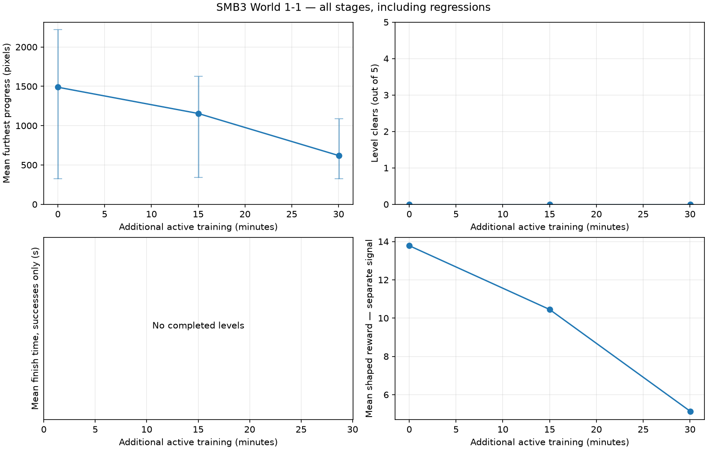
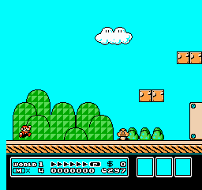
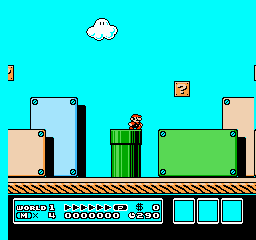
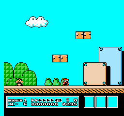
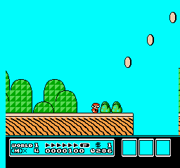
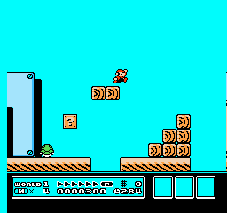

# Watching Mario learn — Super Mario Bros. 3

**Archived failed run:** training stopped at 65.80 active minutes on invalid telemetry. The emergency checkpoint is unevaluated; final acceptance did not run. Three full-start training clears were verified by replay. [Failure, successful replays and limits](FAILURE.md) · [All six verified model downloads](MODELS.md).

## Use this in class

1. Watch the initial policy and predict where Mario will fail.
2. Compare the same seed’s beginning and ending at each checkpoint.
3. Check your impression against every trial, including regressions.
4. Separate what the clips show from hypotheses about why it happened.

[Detailed measurements and all trials](REPORT.md) · [Visual analysis](ANALYSIS.md)

## Learning timeline

Longer sessions save checkpoints approximately every **15 minutes of additional active training**, plus the initial and final models. Evaluation and recording time are measured separately. The table uses actual times, not rounded checkpoint targets. Seeds change sampled actions on the same World 1-1; they do not create new levels.

| Stage | Active minutes in this session | Cumulative model decisions | Mean progress | Median | Min–max | Clears |
|---|---:|---:|---:|---:|---:|---:|
| Initial policy | 0.00 | 456,323 | 1488.6 | 1629.0 | 327–2221 | 0/5 |
| 01-stage | 15.00 | 522,751 | 1154.8 | 1616.0 | 342–1628 | 0/5 |
| 02-stage | 30.03 | 579,799 | 619.0 | 468.0 | 326–1087 | 0/5 |
| 03-stage | 45.03 | 606,102 | 939.4 | 885.0 | 326–1503 | 0/5 |
| 04-stage | 60.03 | 676,280 | 1597.8 | 1408.0 | 1362–2221 | 0/5 |
| emergency | 65.80 | 734,039 | Pending or noncomparable | — | — | — |

Progress is furthest horizontal displacement in pixels, not a completion percentage. Missing or incompatible evaluations are excluded, never scored as zero. Cumulative model decisions include previous sessions when resuming.

Range bars show trial variability, not confidence intervals. Reward is a separate training signal; it does not establish successful play.

## Initial policy · 0.00 active minutes

Saved stage: `00-resumed`. Model identifier: `277ca1daafdfe484b6e0150086eac3a377b045f306fdd8e01073658e211b66ec`.

**What changed:** The archived seven-action checkpoint was resumed with unchanged weights, PPO settings and rewards. Goal-practice resets are the training intervention.

**What visibly improved or happened:** The normal-start evaluation exactly reproduces the parent final results: mean progress 1,488.6 pixels. [Prior visual analysis](../2026-09-20-smb3-recovery-session-02/ANALYSIS.md).

**What still fails:** All five trials die; none completes the level.

**Hypotheses and limits:** Five action samples on the same level do not establish generalization. Goal-practice training successes are not full-level wins. The curriculum may interfere with earlier skills, but these results alone do not establish the cause of regression.

| Beginning · seed 101 · decisions 1–150 | Ending · seed 101 · decisions 217–291 |
|---|---|
|  |  |

The middle of this trial is omitted from these excerpts; the full action trace is retained.

[All trial measurements](00-resumed/evaluation.json) · [Every trial’s clips and traces](REPORT.md)

**Discuss:** What changed visibly? Did every trial improve? What extra evidence would distinguish better jump timing from a favorable action sequence?

## 01-stage · 15.00 active minutes

Saved stage: `01-stage`. Model identifier: `e5a420364a444d1dc9ee72268f1464d56e76f942848b031ee2899e3ba8f8f9ac`.

**Measured change:** mean progress -333.8 pixels; 0/5 level clears.

| Seed | Progress change since previous stage |
|---|---:|
| 101 | -1206 · regression |
| 202 | -1158 · regression |
| 303 | -1 · regression |
| 404 | +1301 |
| 505 | -605 · regression |

Paired seeds are reproducible comparisons, but changed policies can consume randomness differently. Five trials cannot establish reliability.

**What changed:** 15 additional active minutes, using 75% goal-practice reset probability.

**What visibly improved or happened:** Mean normal-start progress falls to 1,154.8 pixels. Reviewed endings show seed 202 at the first plant pipe and seeds 303, 404 and 505 falling between wooden structures. [Reviewed frames](review/01-stage-overview.png).

**What still fails:** All five trials die. Seed 101 dies around the early flying turtle; no full-level completion is demonstrated.

**Hypotheses and limits:** Five action samples on the same level do not establish generalization. Goal-practice training successes are not full-level wins. The curriculum may interfere with earlier skills, but these results alone do not establish the cause of regression.

| Beginning · seed 101 · decisions 1–150 | Ending · seed 101 · decisions 85–159 |
|---|---|
|  |  |

These excerpts overlap; they are two views of the same trial.

[All trial measurements](01-stage/evaluation.json) · [Every trial’s clips and traces](REPORT.md)

**Discuss:** What changed visibly? Did every trial improve? What extra evidence would distinguish better jump timing from a favorable action sequence?

## 02-stage · 30.03 active minutes

Saved stage: `02-stage`. Model identifier: `4dda2cd8cda35d57b3011d8ae16765066fcb968d71b9ebbcc525037dd5d97df4`.

**Measured change:** mean progress -535.8 pixels; 0/5 level clears.

| Seed | Progress change since previous stage |
|---|---:|
| 101 | -234 · regression |
| 202 | +745 |
| 303 | -741 · regression |
| 404 | -1301 · regression |
| 505 | -1148 · regression |

Paired seeds are reproducible comparisons, but changed policies can consume randomness differently. Five trials cannot establish reliability.

**What changed:** 30 additional active minutes with the same first-hour reset mixture; no parameter changes.

**What visibly improved or happened:** Mean normal-start progress falls further to 619 pixels. Seeds 101 and 404 die around the first plant pipe; seed 202 falls into a gap. Seed 303 dies in the open enemy area and seed 505 near an early walking enemy. [Reviewed frames](review/02-stage-overview.png).

**What still fails:** All five trials die. Four paired trials lose progress relative to the 15-minute checkpoint; seed 202 improves from 342 to 1,087 pixels. Overall performance regresses.

**Hypotheses and limits:** Five action samples on the same level do not establish generalization. Goal-practice training successes are not full-level wins. The curriculum may interfere with earlier skills, but these results alone do not establish the cause of regression.

| Beginning · seed 101 · decisions 1–99 | Ending · seed 101 · decisions 25–99 |
|---|---|
|  |  |

These excerpts overlap; they are two views of the same trial.

[All trial measurements](02-stage/evaluation.json) · [Every trial’s clips and traces](REPORT.md)

**Discuss:** What changed visibly? Did every trial improve? What extra evidence would distinguish better jump timing from a favorable action sequence?

## 03-stage · 45.03 active minutes

Saved stage: `03-stage`. Model identifier: `33cfa248c291d974f54adbb2601e3ae5fce0b4dbe4abdbda102d44c3eddd019f`.

**Measured change:** mean progress +320.4 pixels; 0/5 level clears.

| Seed | Progress change since previous stage |
|---|---:|
| 101 | +782 |
| 202 | -761 · regression |
| 303 | +616 |
| 404 | +558 |
| 505 | +407 |

Paired seeds are reproducible comparisons, but changed policies can consume randomness differently. Five trials cannot establish reliability.

**What changed:** 45 additional active minutes with the same first-hour curriculum.

**What visibly improved or happened:** Normal-start mean progress recovers to 939.4 pixels. Seed 101 falls into the gap after the open enemy area; seed 303 falls before the wooden steps. Seeds 404 and 505 die in the open enemy area. [Reviewed frames](review/03-stage-overview.png).

**What still fails:** All five trials die. Seed 202 again dies around the first plant pipe. Progress remains below the resumed model.

**Hypotheses and limits:** Five action samples on the same level provide limited evidence. We cannot infer what Mario understands or attribute recovery to a specific mechanism. Practice clears are not full-level successes.

| Beginning · seed 101 · decisions 1–150 | Ending · seed 101 · decisions 155–229 |
|---|---|
|  |  |

The middle of this trial is omitted from these excerpts; the full action trace is retained.

[All trial measurements](03-stage/evaluation.json) · [Every trial’s clips and traces](REPORT.md)

**Discuss:** What changed visibly? Did every trial improve? What extra evidence would distinguish better jump timing from a favorable action sequence?

## 04-stage · 60.03 active minutes

Saved stage: `04-stage`. Model identifier: `e2c3ca4382e78c77d122adf9e7cad4002c9320eb997eac8f8740b9b30dd6711d`.

**Measured change:** mean progress +658.4 pixels; 0/5 level clears.

| Seed | Progress change since previous stage |
|---|---:|
| 101 | +527 |
| 202 | +1037 |
| 303 | -141 · regression |
| 404 | +523 |
| 505 | +1346 |

Paired seeds are reproducible comparisons, but changed policies can consume randomness differently. Five trials cannot establish reliability.

**What changed:** 60 additional active minutes; this checkpoint concludes the scheduled 75% practice phase.

**What visibly improved or happened:** Mean progress recovers to 1,597.8 pixels, slightly above the resumed mean of 1,488.6. Seed 505 reaches the tall-pipe area. [Reviewed frames](review/04-stage-overview.png).

**What still fails:** All five trials still die. Seed 101 falls between wooden structures; seeds 202, 303 and 404 die around the flying turtles. Seed 505 falls in the tall-pipe area. Recovery in distance is not reliable level completion.

**Hypotheses and limits:** Five action samples on the same level provide limited evidence. We cannot infer what Mario understands or attribute recovery to a specific mechanism. Practice clears are not full-level successes.

| Beginning · seed 101 · decisions 1–150 | Ending · seed 101 · decisions 204–278 |
|---|---|
|  |  |

The middle of this trial is omitted from these excerpts; the full action trace is retained.

[All trial measurements](04-stage/evaluation.json) · [Every trial’s clips and traces](REPORT.md)

**Discuss:** What changed visibly? Did every trial improve? What extra evidence would distinguish better jump timing from a favorable action sequence?

## emergency · 65.80 active minutes

Saved stage: `emergency`. Model identifier: `6e98d6be3a206002ea7260a54bb6f6e619e2634c23197cb0d899563c81427df5`.

**Evaluation incomplete, unavailable, or noncomparable.** No learning claim is made.

## Read the failures, too

The detailed report preserves the hold-run-right baseline and completed checkpoint evaluations. The planned final additional-seed evaluation did not run. Additional seeds test action variation on this same level, not generalization to unseen levels. A final save at the same training time is not another learning interval.

Regenerate this page locally with `python -m smb3_rl.report sessions/SESSION_ID`. Reviewed explanations live in `stage-notes.json`, keyed to the checkpoint hash; generation preserves them and refuses to reuse notes for another model. Future stages are explicitly marked pending visual review until their saved evidence has been inspected.

